# Exemple de déploiement dans Azure Container Apps d'une application multi-tiers
# Front-end ASP.NET Core + 2 API back-end
# Proposition de "stress test" en fin de lab


Ce dépôt contient un scénario de deploiement d'une application web cloud native sur le service Azure Container Apps.  
L'application contient un front `store`et 2 service d'API `products` et `inventory`.  
Les 3 `Containers Apps` repose sur un environnement de type `Consumption Serverless` qui permettra à l'application d'avoir une "scalabilité" totalement managée.  

Dans la dernière étape du lab nous réaliserons un test de charge pour vous permettre de voir comment s'opére cette "scalabilité" automatique.


Le dépôt se compose des éléments suivants :  

* `Store` - Un projet serveur Blazor représentant le frontend d'une boutique en ligne. L'interface utilisateur de la boutique affiche une liste de tous les produits de la boutique et leur statut d'inventaire associé.
* `Products API` - Une API simple qui génère des noms de produits fictifs en utilisant le package open-source NuGet [Bogus](https://github.com/bchavez/Bogus).  
* `Inventory API` - Une API simple qui fournit un nombre aléatoire pour un identifiant de produit donné. Les valeurs de chaque paire chaîne/entier sont stockées en cache mémoire pour être cohérentes entre les appels API.
* `Dossier Infra` - contient les fichiers Azure Bicep utilisés pour créer et configurer toutes les ressources Azure.  
* Fichier de workflow GitHub Actions utilisé pour déployer l'application en utilisant CI/CD.  


## Ce que vous apprendrez  

Cet exercice vous présentera une variété de concepts, avec des liens vers la documentation tout au long du tutoriel.  

* [Azure Container Apps](https://docs.microsoft.com/azure/container-apps/overview)  
* [GitHub Actions](https://github.com/features/actions)  
* [Azure Container Registry](https://docs.microsoft.com/azure/container-registry/)  
* [Azure Bicep](https://docs.microsoft.com/azure/azure-resource-manager/bicep/overview?tabs=**bicep**)  


## Prérequis  

Vous aurez besoin de :  
1. Un abonnement Azure.  
2. Un compte GitHub, avec accès à GitHub Actions.  
3. [Azure CLI](https://docs.microsoft.com/cli/azure/install-azure-cli) installé localement, ou bien un accès a Azure Cloud Shell depuis le portal Azure. 


## Diagramme d'architecture fonctionnelle  

L'application est un ensemble 3 conteneurs hébergés dans un environnement Azure Container Apps - l'API `products`, l'API `inventory` et le frontend Blazor Server `store`.  


Le trafic Internet ne doit pas pouvoir accéder directement aux API back-end car chacun de ces conteneurs est marqué comme "internal ingress only" pendant la phase de déploiement.  

Le trafic Internet accédant à l'URL `store.<your app>.<your region>.azurecontainerapps.io` doit être acheminé vers le conteneur `frontend`, qui à son tour effectue des appels interne, au sein de l'environnement Azure Container Apps, vers les API `products` et `inventory`.  


## Configuration  

À la fin de cette section, vous aurez une application contenant 3 nœuds fonctionnant dans Azure Container Apps.  
Cette application utilise un modèle de deploiement de type `consumption` qui est `serverless`.  

Ce processus de configuration se compose de deux étapes et devrait vous prendre environ 15 minutes.  
1. Utilisez le CLI Azure pour créer `Azure Service Principal`, puis stockez la définition JSON de ce principal dans un secret GitHub afin que le processus CI/CD de GitHub Actions puisse se connecter à votre souscription Azure et déployer le code.  
2. Modifiez le fichier de workflow `deploy.yml` et poussez les modifications dans une nouvelle branche `deploy`, ce qui déclenchera GitHub Actions pour créer l'environnement Container Apps, construire des containers pour les projets .NET  et pousser ces conteneurs l'environnement Container Apps.  


## Mise en place de l'Authentification à Azure, Fork et configuration du dépôt avec le rajout des secrets  

1. "Forkez" ce dépôt dans votre propre organisation GitHub.  

2. Connectez vous à Azure (pas necessaire si vous utilisez Azure Portal Cloud Shell

```bash
az login
```    

Dans le cas ou votre utilisateur à accès à plusieurs tenants il peut être necessaire de spécifier le tenant cible.
```bash
az login --tenant xxxxxxxx-xxxx-xxxx-xxxx-xxxxxxxxxxxx
```    

Vérifiez avec 
```bash
az account show
```    


3. Créez un `Azure Service Principal` en utilisant `Azure CLI`.  

Tout d'abord nous allons créer la variable `$subscription`
```bash
subscriptionId=$(az account show --query id --output tsv)
```  
Et ensuite créer le `Service Principal` dans Entra ID.
```bash
az ad sp create-for-rbac --sdk-auth --name WebAndApiSample --role owner --scopes /subscriptions/$subscriptionId
```  

3. Copiez le JSON affiché à l'écran dans votre presse-papiers.  

```json
{
  "clientId": "",
  "clientSecret": "",
  "subscriptionId": "",
  "tenantId": "",
  "activeDirectoryEndpointUrl": "https://login.microsoftonline.com/",
  "resourceManagerEndpointUrl": "https://brazilus.management.azure.com",
  "activeDirectoryGraphResourceId": "https://graph.windows.net/",
  "sqlManagementEndpointUrl": "https://management.core.windows.net:8443/",
  "galleryEndpointUrl": "https://gallery.azure.com",
  "managementEndpointUrl": "https://management.core.windows.net"
}
```  

4. Créez un nouveau secret GitHub dans votre fork nommé `AzureSPN`. Collez le JSON retourné par le CLI Azure dans ce nouveau secret.  

   

Créez un deuxième secret GitHub dans votre fork nommé `AZURE_SUBSCRIPTION_ID`. Fournissez l'identifiant de la souscription Azure spécifique que vous souhaitez utiliser comme valeur pour ce secret.  
Une fois terminé vous verrez les 2 secrets.  

   

Remarque : Ne jamais sauvegarder le JSON sur disque, car cela permettrait à quiconque obtenant ce code JSON de créer ou de modifier des ressources dans votre abonnement Azure.!!!  

## Déployer le code en utilisant GitHub Actions  

Le moyen le plus simple de déployer le code est de faire un commit directement dans la branche deploy. Faites-le en naviguant dans le fichier deploy.yml (dans .github\workflows) dans votre navigateur et en cliquant sur le bouton Edit.  


Fournissez un nom d'environnement personnalisé qui sera utilisé pour le nom de `Resssource Group` Azure , puis validez la modification (cliquez sur le bouton "COMMIT CHANGES" dans une nouvelle branche nommée `deploy`.  


Une fois que vous aurez cliqué sur le bouton `Propose changes`, vous serez en mode "creation d'un pull request". Ne vous inquiétez avec le `pull request` pour le moment, cliquez simplement sur l'onglet Actions, et vous verrez que le déploiement va démarrer...  


Lorsque vous cliquez dans le workflow, vous verrez qu'il y a les phases que le CI/CD parcourra :  
- provision - les ressources Azure seront créées pour héberger votre application.  
- deploy - les build des différents projets .NET sont réalisés dans des conteneurs et publiés dans l'instance Azure Container Registry créée pendant la provision.une fois build terminé, les images sont dans ACR, et  les Azure Container Apps sont mises à jour pour héberger les images de conteneurs nouvellement publiées.  


Après quelques minutes, les étapes du workflow seront terminées, et chaque étape dans le diagramme du workflow affichera son état d'execution. Si quelque chose échoue, vous pouvez cliquer dans les étapes du processus pour examiner les détails.  


Avec les projets déployés sur `Azure Container Apps`, vous pouvez maintenant tester l'application pour vous assurer qu'elle fonctionne.  


## Tester l'application dans Azure

Le processus CI/CD deploy crée une série de ressources dans votre abonnement Azure. Celles-ci sont principalement utilisées pour héberger le code du projet, mais il y a également quelques ressources supplémentaires.

| Resource     | Resource Type                                                | Purpose                                                      |
| ------------ | ------------------------------------------------------------ | ------------------------------------------------------------ |
| appi-xxx   | Application Insights                                         | Fournit des informations de télémétrie et de diagnostic lorsque permettant de surveiller les performances de l’application ou lorsque des problèmes doivent être résolus. |
| ca-store     | Azure Container Apps qui héberge le code du serveur frontal. | Store est l’application frontale exécutant un projet Blazor Server qui utilse les API du backend |
| ca-products  | Azure Container Apps qui héberge le code de l'API product. | C'est une API compatible Swagger qui transmet les noms et les ID des produits aux appelants. |
| ca-inventory | Azure Container Apps qui héberge le code de l'API inventory. | C'est une API compatible Swagger qui restitue les quantités pour les ID de produit. Un client doit d’abord appeler l’API « products » pour obtenir la liste des ID de produit, puis utiliser ces ID de produit comme paramètres de l’API « stock » pour obtenir la quantité d’un article particulier en stock.|
| cae-xxx      | Azure Container Apps Environment                          | C'est l'insfrasturcture qui permet aux différentes Containers Apps de s'exécuter. Dans cet example nous utilisons un modème `consumption` `serverless` |
| crxxxx      | Azure Container Registry                                  | Il s’agit du registre de conteneurs dans lequel le processus CI/CD publie mes conteneurs d’application lorsque je valide le code dans la branche « deploy ». À partir de ce registre, les conteneurs sont extraits et chargés dans Azure Container Apps. |
| log-xxx     | Log Analytics Workspace                                      | C’est là que je peux effectuer des requêtes [Kusto](https://docs.microsoft.com/azure/data-explorer/kusto/query/) sur les données de télémétries de mon application. |  

Les ressources sont affichées ici dans le portail Azure :  


Cliquez sur l'application Container Apps `store` pour l'ouvrir dans le portail Azure. Dans l'onglet `Overview`, vous verrez une URL.  


En cliquant sur cette URL, vous ouvrirez le frontend de l'application dans le navigateur.  


Vous verrez que la première demande prendra légèrement plus de temps que les demandes suivantes. Lors de la première demande de la page, les API sont appelées côté serveur. Le code utilise `IMemoryCache`.


## Test de charge avec le service Azure Load Testing

Maintenant nous allons laisser l'environnement Github pour aller dans le [Portail Azure](https://portal.azure.com)  
Rendez-vous dans la marketplace Azure pour recherche le service `Azure Load Testing`.  

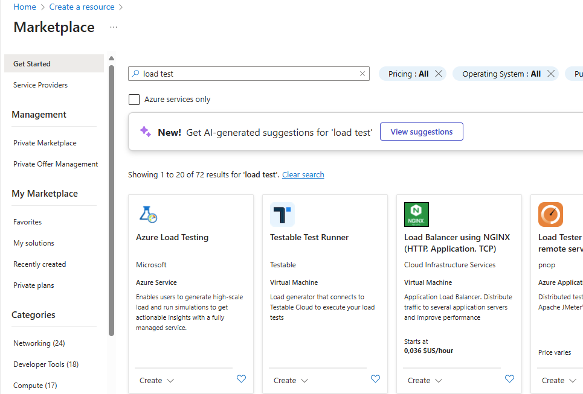.

Lancer la creation d'une ressources `Azure Load Testing`:  
- Renseigner le nom d'un Ressource Group Azure.  
- Choisir une région (La même région que celle ou a été précédement déployée votre application. Ceci pour éviter des flux de communication inutile entre l'instance de test et celle de Container Apps.  


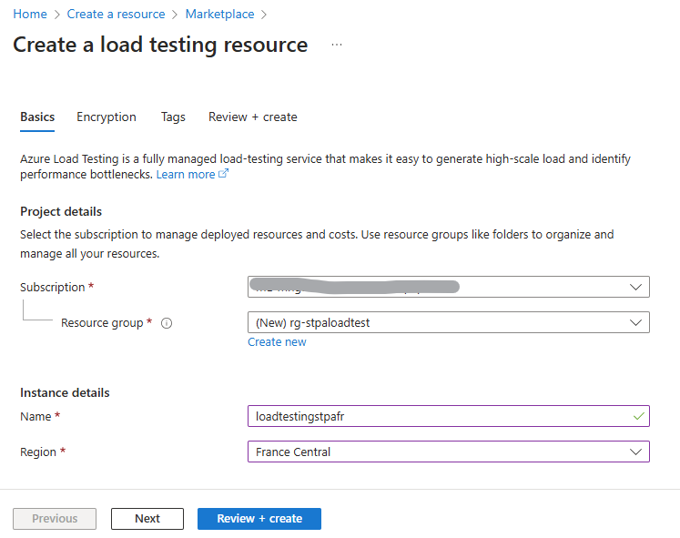.

Une fois la ressource crée, rendez-vous dans le `Ressource Group` ou vous trouverez votre service de test de charge que vous venez de créer.  


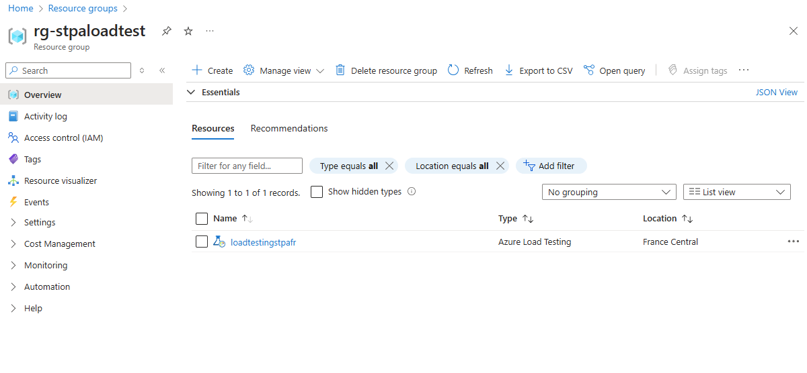.

Cliquez sur le service Load Tesing affiché.  


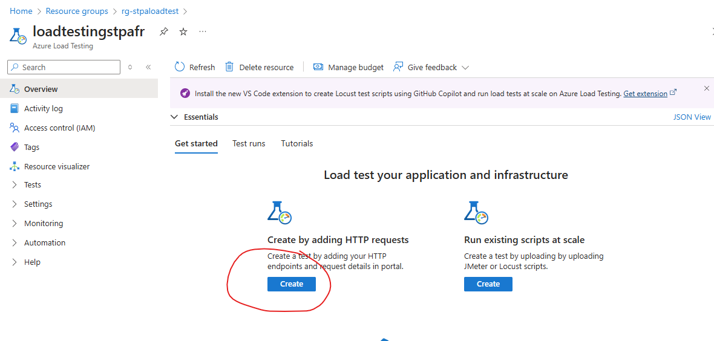.
 
A partir du service nous allons créer un scenario de test simple basé sur une URL HTTP.  
Cliquez sur `Create by adding HTTPS request` pour lancer la création du scénario de test.  


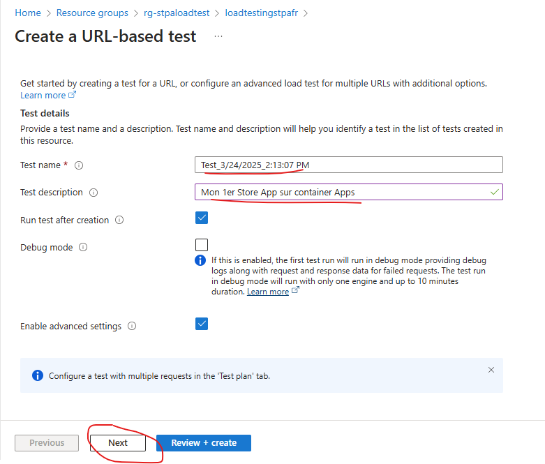.  

Veuillez renseigner le nom du test,  sa description ainsi quue les cases à cocher telles que sur la copie d'écran ci-dessus.  
Cliquez ensuite sur next.  


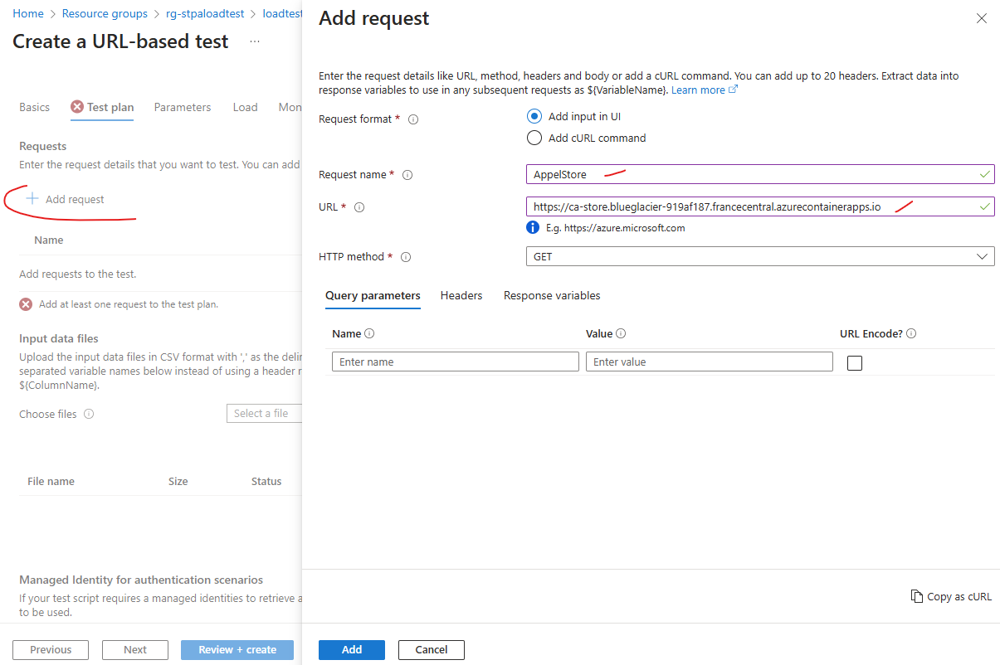.  

Cliquez sur Add Request et renseignez le Nom de la requête ansi que l'URL de l'application (Celle de l'application Store créée dans l'étape précédente).  
Cliquez ensuite sur  `Add`, puis 2x sur next pour se rendre dans l'écran `Load`.  


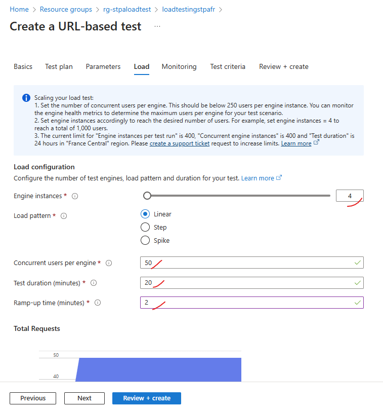.  

Dans les paramètre de `Load`, vous pouvez suivre les paramètres proposés.  
Cliquez ensuite sur `Review and Create` et si tout est OK vous pouvez lancer la création.  
Le test sera lancé automatiquement après sa création.  


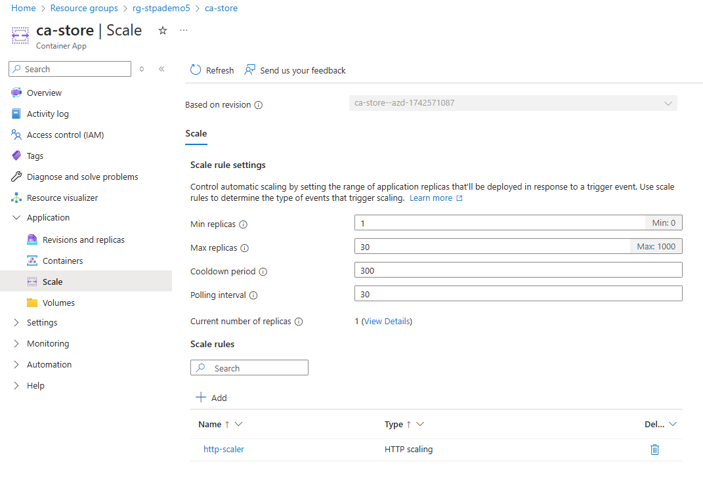.  

Pendant la création du service vous pouvez aller examiner les paramètres du container Apps `ca-store`.  


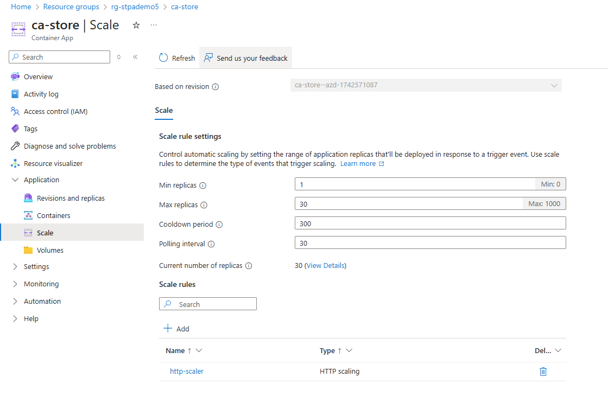.  

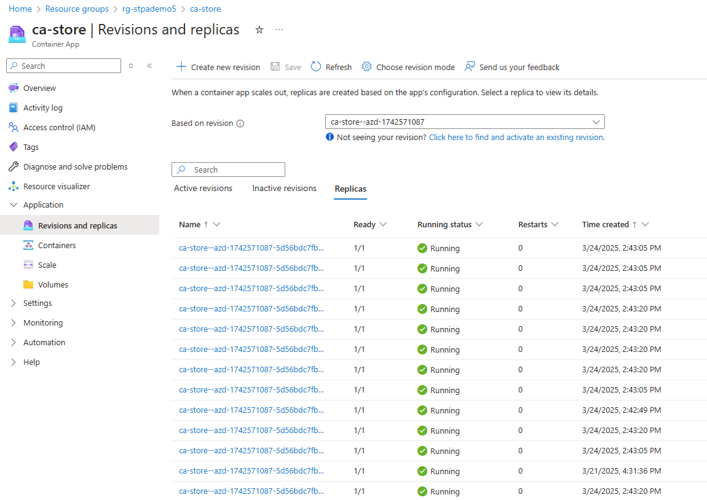.  

Et vous pourrez observer la montée en charge rapide des instances qui se fait automatiquement.
Idem pour `ca-product` et `ca-inventory` qui vont ensuite redescendre au nombre min au bout de 5 min conformément au paramètre `cool down` (merci au cache mémoire).


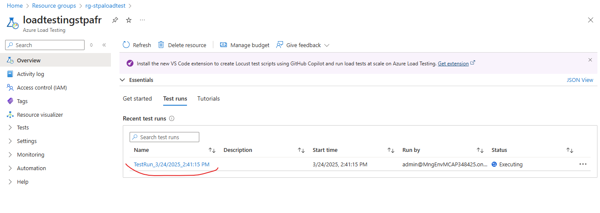.

Vous pouvez revenir sur le service de `Load Testing` pour allez examiner les métriques d'execution du scénario


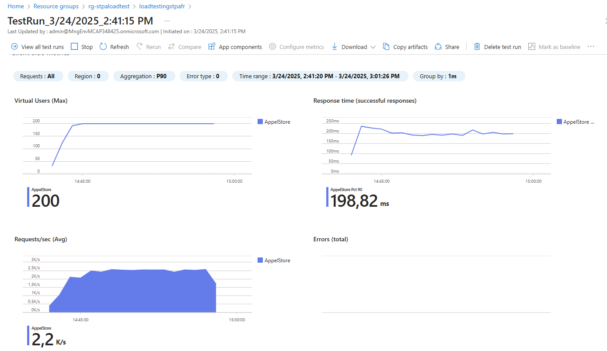.  

Vous pouvez vous amuser à faire varier le nombre d'instance de votre application (`store` pour voir l'impact sur les performances du test).  


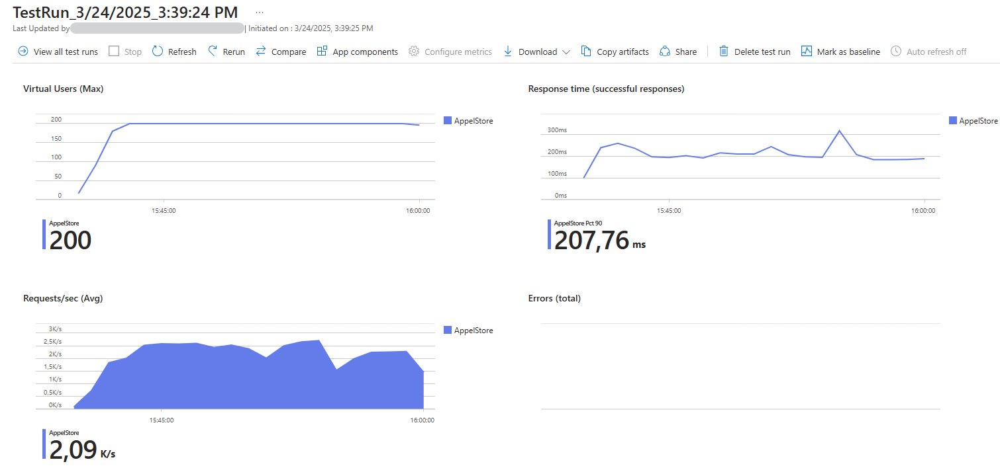.  

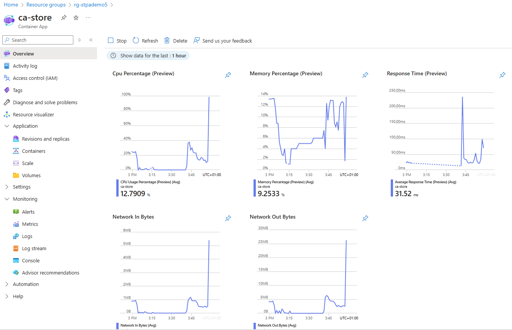.  


# Suppression des ressources.  

Une fois les tests terminés pensez à supprimer les ressources en supprimant  
- les 2 Ressources Group (celui de l'application Store Container Apps et celui du Load Testing).  
- les 2 secrets créés dans le repo Github (AZURESPN AZURE_SUBSCRIPTION_ID)
- le service principal

```bash
spId=$(az ad sp list --display-name WebAndApiSample --query "[].{id:appId}" --output tsv)
az ad sp delete --id $spId
```  


